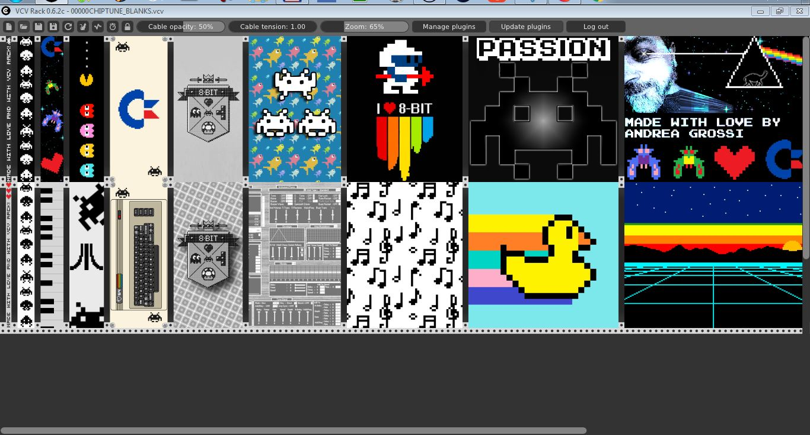

# Chiptuner-0.6.2

Friendly Greetings! This is my second attempt to make blank plates for VCV Rack! I have been inspired by [Omri Cohen](https://bit.ly/2P2watb) so a big thank go to him!

The technical part (coding, understanding how stuffs work) is given by [David O'Rourke](https://github.com/david-c14), [Clement Foulc](https://github.com/cfoulc/cf) and [VCV Rack](https://github.com/VCVRack/Rack) since I've mostly "steal" all the informations from them! 1024 thanks to [Nik Jewell](https://github.com/lnikj) for providing the Mac version of the plugin and to him and Jeff Orgill for proving me that the source code works properly both on Win & on Mac (I have good chances that it will work on Nix systems as well, at this point)!

The fonts I have used are all free and freely downloadable from these sites (or from my repo):

[DFF](https://www.download-free-fonts.com/details/36131/karmatic-arcade)

[FONTS4FREE](https://www.fonts4free.net/visitor-font.html)

[STYLE64](http://style64.org/c64-truetype)

[DAFONT](https://www.dafont.com/commodore-64.font)

Ditto for the pictures I have used in my plates.

Chiptuner-0.6.2 2019 Edition is available for free. Feel free to download it, use it, redistribute it as you will.
If you are thinking to earn some money from it, please at least drop me a message and say "thank you"! I'd appreciate it!

I made some correction in the PNGs files, added the 2HP panel and added a whole new series of panels you can find under the menu "Extreme" when you rightclick on panel: basically there are 3 choiches now, BASE, ALTERNATIVE and EXTREME (the first row of panels is the base one, the second row are the alternative, the third one are the extreme)

Oh, and put a couple of reference for old C64 gamers like me! If you spotted it and recognized it, drop me a line here or in the VCV RACK group in Facebook! I will be very pleased to meet another hard core gamer!

Yeah, because it takes a really hard core gamer to spot the loving obeisance to the fabulous era of C64 games so my best compliment to Peraza Santiago that has been able to spot the first one! Yay!

If something is wrong or not working properly, please let me know!

Have fun!
